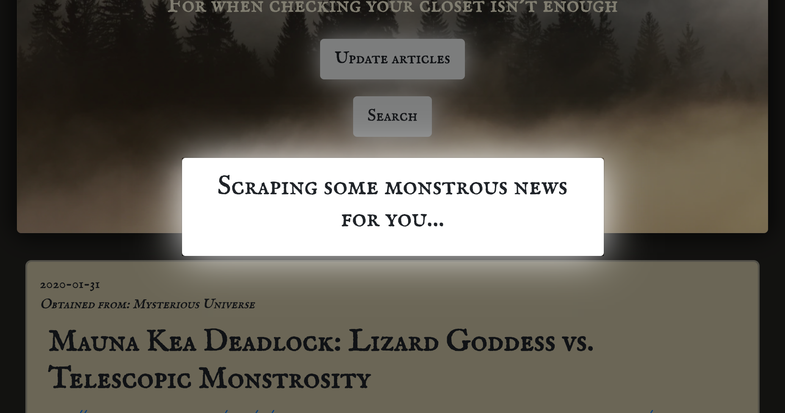

# Monster News
A news aggregator website that scrapes articles from various websites on a variety of supernatural and paranormal topics. A one-stop shop for keeping tabs on everything supposed and spooky.

## Technologies used:
- mongoDB
- express.js
- cheerio.js
- handlebars.js

#### Update articles

Press the update button to scrape the web for new articles! This signals the server to run through its scraping processes and give you the latest monster stuff.

#### View articles and comments

Scroll down to view articles from various news sites and read what others have to say about them. The articles are listed newest-first to give you easy-access to the freshest material.

#### Add your own comments

Click the 'add comment' button to contribute to the discussion. Monster News lets you decide what alias to use, so have fun with it.

#### Search and filter

There are a lot of articles, so you can use the search button to filter by source and/or search by title keywords.

### Made completely by Noah Sylwester